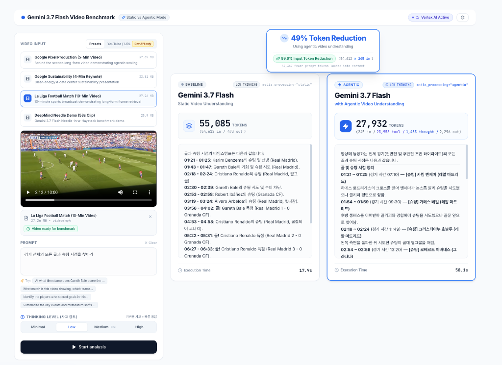

# Gemini 3.7 Flash Video Benchmark: Static vs Agentic Processing

A web application for benchmarking **Gemini 3.7 Flash** in **Static Video Understanding** (`media_processing="static"`) against **Agentic Video Understanding** (`media_processing="agentic"`).

<p align="center">
  
</p>

---

## Overview

In **Agentic Video Understanding**, Gemini 3.7 Flash inspects and navigates video frames on demand through internal tool calls, rather than uniformly sampling the entire video into input tokens up front.

This application benchmarks the two approaches side by side:
- **Token Usage**: Compares total, prompt, tool frame, and thinking tokens.
- **Latency**: Measures wall-clock execution time with independent timers.
- **Thinking Budget**: Tests configurable thinking levels (`minimal`, `low`, `medium`, `high`).
- **Extraction Quality**: Displays timestamps and descriptions returned by each mode.

---

## Architecture

```
+-----------------------------------------------------------------------------------+
| Frontend: React + Vite + Tailwind CSS SPA                                         |
|                                                                                   |
|  [TopNav: Title | Mode Pill | API Status Badge | Settings Modal]                  |
|  +---------------------------+-------------------------------------------------+  |
|  | Left Input Panel          | Right Side-by-Side Comparison Panel             |  |
|  | - Video Preset Selector   | - Baseline Card (Static, Gray, Tokens breakdown)|  |
|  | - Video Preview Player    | - Agentic Card (Agentic, Blue, Tokens breakdown)|  |
|  | - Prompt & Preset Ideas   | - Floating Total Token Reduction Callout        |  |
|  | - Thinking Level Selector | - Independent Real-Time Stopwatches             |  |
|  | - Start Analysis Action   |                                                 |  |
|  +---------------------------+-------------------------------------------------+  |
+----------------------------------------+------------------------------------------+
                                         | HTTP REST API
                                         v
+-----------------------------------------------------------------------------------+
| Backend: FastAPI (Python 3.13 / Uvicorn on 0.0.0.0:8000)                          |
|                                                                                   |
|  - GET  /api/health            -> Service health status                           |
|  - GET  /api/settings          -> Active provider & credential status             |
|  - GET  /api/preset            -> Video metadata for demo clips                   |
|  - GET  /api/preset/video      -> Stream local MP4 (HTTP 206 Range supported)     |
|  - POST /api/analyze           -> Dual parallel generation via asyncio.gather     |
|  - Static Files Mount (/)      -> Serves compiled frontend/dist SPA               |
+-----------------------------------------------------------------------------------+
                                         | google-genai SDK (v1beta1)
                                         v
+-----------------------------------------------------------------------------------+
| Google GenAI Platform (Gemini 3.7 Flash)                                          |
| - Gemini Developer API (API Key) OR Vertex AI (ADC / Project / global location)   |
| - Baseline: media_processing="static"                                             |
| - Agentic:  media_processing="agentic"                                            |
+-----------------------------------------------------------------------------------+
```

---

## Quick Start

### Prerequisites
- **Python**: 3.10 or higher
- **Node.js**: 18 or higher (with `npm`)

### 1. Launch with Unified Runner (`run.sh`)
The `run.sh` script sets up the Python virtual environment, installs backend and frontend dependencies, compiles the frontend, and starts the server:

```bash
./run.sh
```

The application builds the frontend bundle and starts the FastAPI server on:
- **Web UI**: [http://localhost:8000](http://localhost:8000)
- **Health Endpoint**: [http://localhost:8000/api/health](http://localhost:8000/api/health)

### 2. Configure Credentials
Set credentials through environment variables or directly in the Web UI:

#### Option A: Vertex AI (Recommended)
```bash
export GOOGLE_CLOUD_PROJECT="your-gcp-project-id"
export GOOGLE_CLOUD_LOCATION="global"  # Gemini 3.7 Flash requires 'global'
gcloud auth application-default login
./run.sh
```

#### Option B: Gemini Developer API
```bash
export GEMINI_API_KEY="your-gemini-api-key"
./run.sh
```

#### Option C: In-App Settings Modal
Click the **Gear icon** in the top navigation bar to enter your Gemini API Key or Vertex AI Project ID.

---

## Testing

### Backend Unit Tests
Run the pytest suite covering API contracts, video streaming, credentials, and token accounting:

```bash
PYTHONPATH=. .venv/bin/pytest backend/tests -v
```

### End-to-End Browser Tests
Run the Playwright headless browser test suite:

```bash
./tests/e2e/run_headless_e2e.sh
```

---

## License
This project is licensed under the Apache License, Version 2.0.
